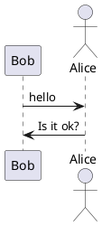
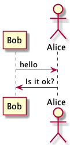
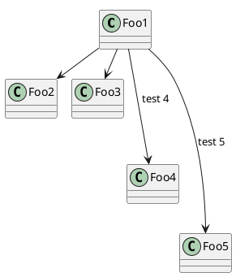
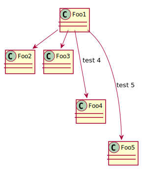
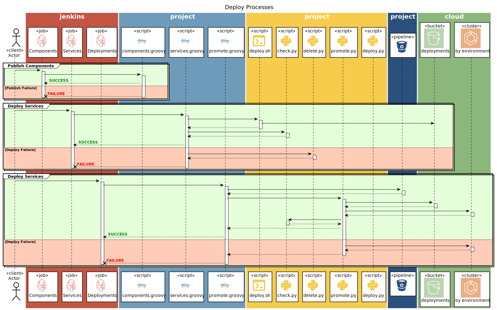
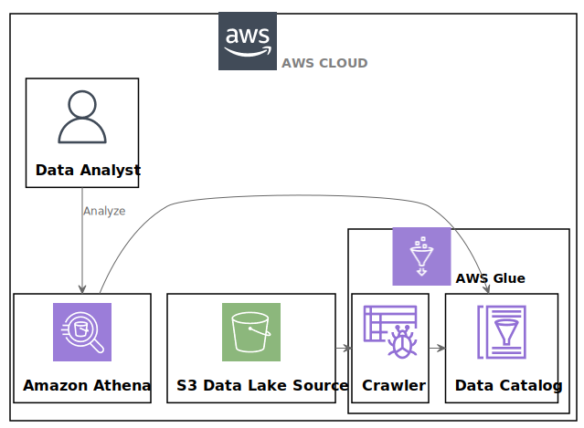
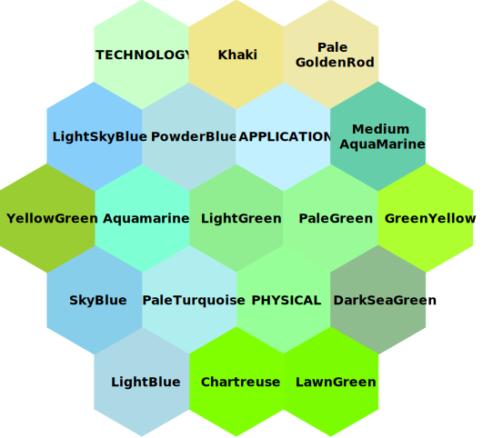

:warning: PLEASE, DO NOT EDIT THIS FILE.
IT IS AUTOGENERATE YOU SHOULD EDIT `modules/docs/src/main/mdoc/README.md`
WITH THE COMMAND `sbt mdoc-modifier-docs/mdoc`

---

<p align="center" style="font-size:.85em">:bowtie:</p>
<h1 align="center">Mdoc Modifier 0.1</h1>
<p align="center">
  <a href="https://www.paypal.com/cgi-bin/webscr?cmd=_donations&business=HE7K7HLJJBVWN&currency_code=EUR&source=url">
    
  </a>
  <a href="https://github.com/scala/scala/releases">
    
  </a>  
  <a href="https://www.oracle.com/technetwork/java/javase/11all-relnotes-5013287.html">
    
  </a>  
  <a href="https://github.com/sbt/sbt/releases">
    
  </a>
  <a href="https://maven-badges.herokuapp.com/maven-central/io.github.mvillafuertem/mdoc-modifier-plantuml_2.13">
    
  </a>
  <a href="https://github.com/mvillafuertem/mdoc-modifier/actions?query=workflow%3A%22scalaci%22">
    
  </a>      
  <a href="https://circleci.com/gh/mvillafuertem/mdoc-modifier">
    
  </a>  
  <a href="https://travis-ci.com/mvillafuertem/mdoc-modifier">
    
  </a>
</p> 


[TOC]

TODO: Description


## Akka HTTP

```scala

libraryDependencies += "io.github.mvillafuertem" %% "mdoc-modifier-akka-http" % "0.1"

```


```scala
import org.scalatest._
import io.github.mvillafuertem.mdoc.modifier.akka.http.sample.SampleApplicationSpec

nocolor.run(new SampleApplicationSpec)
// SampleApplicationSpec:
// Sample Application
// Complete(HttpResponse(200 OK,List(),HttpEntity.Strict(application/json,16 bytes total),HttpProtocol(HTTP/1.1)))
// 
// ## `GET / http://example.com/health`
// 
// List()
// 
// 
// ```
// 
// HttpEntity.Strict(none/none,0 bytes total)
// 
// ```
// 
// ### Response
// 
// HTTP/1.1 200 OK
// 
// List()
// 
// ```
// 
// HttpEntity.Strict(application/json,16 bytes total)
// 
// ```
//        
// - should health
```


SampleApplicationSpec:
Sample Application
Complete(HttpResponse(200 OK,List(),HttpEntity.Strict(application/json,16 bytes total),HttpProtocol(HTTP/1.1)))

## `GET / http://example.com/health`

List()


```

HttpEntity.Strict(none/none,0 bytes total)

```

### Response

HTTP/1.1 200 OK

List()

```

HttpEntity.Strict(application/json,16 bytes total)

```
       
- should health


## PlantUML :bar_chart:

```scala

libraryDependencies += "io.github.mvillafuertem" %% "mdoc-modifier-plantuml" % "0.1"

```

### How use

Only add this, that's all

```
scala mdoc:plantuml:modules/mdoc-modifier-docs/src/main/resources/result0:png
```


@see http://plantuml.com/sitemap-language-specification




### Support SVG


### Troubleshooting :scream:

#### Can not find Graphviz

* Install Graphviz

more information see http://plantuml.com/es/graphviz-dot

* Add this line to diagram
    
```
!pragma layout smetana
```

more information see http://plantuml.com/es/smetana02








### Choosing colors 




