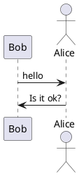

:warning: PLEASE, DO NOT EDIT THIS FILE.
IT IS AUTOGENERATE YOU SHOULD EDIT `docs/src/main/mdoc/README.md`
WITH THE COMMAND `sbt docs/mdoc`

---

# Mdoc Modifier 0.1

[TOC]

TODO: Description

- [x] Scala SDK 2.13.1
- [x] SBT 1.3.3


## Akka HTTP

```scala

libraryDependencies += "io.github.mvillafuertem" %% "mdoc-modifier-akka-http" % "0.1"

```

## PlantUML

```scala

libraryDependencies += "io.github.mvillafuertem" %% "mdoc-modifier-plantuml" % "0.1"

```

### How use

Only add this, that's all

```
scala mdoc:plantuml:docs/src/main/resources/result0:png
```


@see http://plantuml.com/sitemap-language-specification




@see http://plantuml.com/es/smetana02

```plantuml

@startuml
!pragma graphviz_dot jdot
class Foo1

Foo1 --> Foo2
Foo1 --> Foo3
Foo1 ---> Foo4 : test 4
Foo1 ----> Foo5 : test 5

@enduml

```

