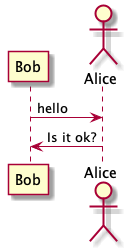

:warning: PLEASE, DO NOT EDIT THIS FILE.
IT IS AUTOGENERATE YOU SHOULD EDIT `docs/src/main/mdoc/README.md`
WITH THE COMMAND `sbt docs/mdoc`

---

# Mdoc Modifier 0.1

[TOC ]

TODO: Description

- [x] Scala SDK 2.13.1
- [x] SBT 1.3.3


## Akka HTTP

```scala

libraryDependencies += "io.github.mvillafuertem" %% "mdoc-modifier-akka-http" % "0.1"

```

## PlantUML

```scala

libraryDependencies += "io.github.mvillafuertem" %% "mdoc-modifier-plantuml" % "0.1"

```

Flow 

```scala 

participant Bob
actor Alice
 
Bob -> Alice : hello
Alice -> Bob : Is it ok?

```

