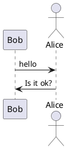

:warning: PLEASE, DO NOT EDIT THIS FILE.
IT IS AUTOGENERATE YOU SHOULD EDIT `docs/src/main/mdoc/README.md`
WITH THE COMMAND `sbt docs/mdoc`

---

# @PROJECT_NAME@ @VERSION@ :bowtie:

[](https://maven-badges.herokuapp.com/maven-central/io.github.mvillafuertem/mdoc-modifier-plantuml_2.13)
[](https://travis-ci.com/mvillafuertem/mdoc-modifier)
[](https://circleci.com/gh/mvillafuertem/mdoc-modifier)

[TOC]

TODO: Description

- [x] Scala SDK @SCALA_VERSION@
- [x] SBT @SBT_VERSION@


## Akka HTTP

```scala

libraryDependencies += "io.github.mvillafuertem" %% "mdoc-modifier-akka-http" % "@VERSION@"

```

## PlantUML :bar_chart:

```scala

libraryDependencies += "io.github.mvillafuertem" %% "mdoc-modifier-plantuml" % "@VERSION@"

```

### How use

Only add this, that's all

```
scala mdoc:plantuml:docs/src/main/resources/result0:png
```


@see http://plantuml.com/sitemap-language-specification



```scala mdoc:plantuml:docs/src/main/resources/result0:png

participant Bob
actor Alice
 
Bob -> Alice : hello
Alice -> Bob : Is it ok?

```


### Troubleshooting :scream:

#### Can not find Graphviz

1. Install Graphviz

    more information see http://plantuml.com/es/graphviz-dot

2. Add this line to diagram
    
    ```
    !pragma graphviz_dot jdot
    ```
    
    more information see http://plantuml.com/es/smetana02
    
    ```plantuml
    
    @startuml
    !pragma graphviz_dot jdot
    class Foo1
    
    Foo1 --> Foo2
    Foo1 --> Foo3
    Foo1 ---> Foo4 : test 4
    Foo1 ----> Foo5 : test 5
    
    @enduml
    
    ```
    
    ```scala mdoc:plantuml:docs/src/main/resources/result1:png
    
    !pragma graphviz_dot jdot
    class Foo1
    
    Foo1 --> Foo2
    Foo1 --> Foo3
    Foo1 ---> Foo4 : test 4
    Foo1 ----> Foo5 : test 5
    
    ```