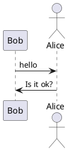
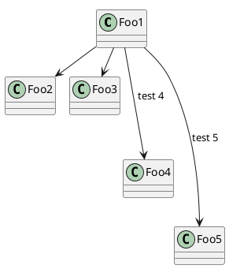

:warning: PLEASE, DO NOT EDIT THIS FILE.
IT IS AUTOGENERATE YOU SHOULD EDIT `modules/docs/src/main/mdoc/README.md`
WITH THE COMMAND `sbt mdoc-modifier-docs/mdoc`

---

<p align="center" style="font-size:.85em">:bowtie:</p>
<h1 align="center">@PROJECT_NAME@ @VERSION@</h1>
<p align="center">
  <a href="https://www.paypal.com/cgi-bin/webscr?cmd=_donations&business=HE7K7HLJJBVWN&currency_code=EUR&source=url">
    
  </a>
  <a href="https://github.com/scala/scala/releases">
    
  </a>  
  <a href="https://www.oracle.com/technetwork/java/javase/11all-relnotes-5013287.html">
    
  </a>  
  <a href="https://github.com/sbt/sbt/releases">
    
  </a>
  <a href="https://maven-badges.herokuapp.com/maven-central/io.github.mvillafuertem/mdoc-modifier-plantuml_2.13">
    
  </a>
  <a href="https://github.com/mvillafuertem/mdoc-modifier/actions?query=workflow%3A%22scalaci%22">
    
  </a>      
  <a href="https://circleci.com/gh/mvillafuertem/mdoc-modifier">
    
  </a>  
  <a href="https://travis-ci.com/mvillafuertem/mdoc-modifier">
    
  </a>
</p> 


[TOC]

TODO: Description


## Akka HTTP

```scala

libraryDependencies += "io.github.mvillafuertem" %% "mdoc-modifier-akka-http" % "@VERSION@"

```


```scala mdoc

import org.scalatest._
import io.github.mvillafuertem.mdoc.modifier.akka.http.sample.SampleApplicationSpec

nocolor.run(new SampleApplicationSpec)
```


```scala mdoc:passthrough

import org.scalatest._
import io.github.mvillafuertem.mdoc.modifier.akka.http.sample.SampleApplicationSpec

nocolor.run(new SampleApplicationSpec)

```


## PlantUML :bar_chart:

```scala

libraryDependencies += "io.github.mvillafuertem" %% "mdoc-modifier-plantuml" % "@VERSION@"

```

### How use

Only add this, that's all

```
scala mdoc:plantuml:modules/mdoc-modifier-docs/src/main/resources/result0:png
```


@see http://plantuml.com/sitemap-language-specification



```scala mdoc:plantuml:@RESOURCES@/result0:png

@startuml

participant Bob
actor Alice
 
Bob -> Alice : hello
Alice -> Bob : Is it ok?

@enduml

```

### Support SVG

```scala mdoc:plantuml:@RESOURCES@/result0:svg

@startuml

participant Bob
actor Alice
 
Bob -> Alice : hello
Alice -> Bob : Is it ok?

@enduml

```


### Troubleshooting :scream:

#### Can not find Graphviz

* Install Graphviz

more information see http://plantuml.com/es/graphviz-dot

* Add this line to diagram
    
```
!pragma layout smetana
```

more information see http://plantuml.com/es/smetana02



```scala mdoc:plantuml:@RESOURCES@/result1:svg

@startuml

!pragma layout smetana
class Foo1

Foo1 --> Foo2
Foo1 --> Foo3
Foo1 ---> Foo4 : test 4
Foo1 ----> Foo5 : test 5

@enduml

```

```scala mdoc:plantuml:@RESOURCES@/result2:svg

@startuml

!pragma layout smetana
!define STDLIB https://raw.githubusercontent.com/plantuml/plantuml-stdlib/master
!includeurl STDLIB/awslib/AWSCommon.puml
!includeurl STDLIB/awslib/Storage/SimpleStorageServiceS3.puml
!includeurl STDLIB/awslib/Compute/ElasticContainerService.puml
!includeurl STDLIB/tupadr3/devicons/jenkins.puml
!includeurl STDLIB/tupadr3/devicons/python.puml
!includeurl STDLIB/tupadr3/devicons/groovy.puml
!includeurl STDLIB/tupadr3/devicons/java.puml
!includeurl STDLIB/tupadr3/devicons/jenkins.puml
!includeurl STDLIB/tupadr3/devicons/git.puml
!includeurl STDLIB/tupadr3/devicons/bitbucket.puml
!includeurl STDLIB/material/console.puml

title Deploy Processes

skinparam sequence {
    ParticipantFontName Avenir-Medium
    ArrowColor #000
    LifeLineBorderColor #000
    LifeLineBackgroundColor #FFF
    ActorBorderColor #000
    ActorBackgroundColor #FFF
    ParticipantBorderColor #000
    ParticipantBackgroundColor #FFF
    GroupBackgroundColor #FFF
    ArrowFontColor #000
    BoxFontColor #FFF
    BoxBorderColor #FFF
}

actor Actor <<client>>

box <size:20>jenkins</size> #C45543
participant job1 as "<color:#C45543><$jenkins></color>\nComponents" <<job>>
participant job2 as "<color:#C45543><$jenkins></color>\nServices" <<job>>
participant job3 as "<color:#C45543><$jenkins></color>\nDeployments" <<job>>
end box

box <size:20>project</size> #6E9BB9
participant class1 as "<color:#6E9BB9><$groovy></color>\ncomponents.groovy" <<script>>
participant class2 as "<color:#6E9BB9><$groovy></color>\nservices.groovy" <<script>>
participant class3 as "<color:#6E9BB9><$groovy></color>\npromote.groovy" <<script>>
end box

box <size:20>project</size> #F7CB4B
participant script1 as "<color:#F7CB4B><$ma_console></color>\ndeploy.sh" <<script>>
participant script2 as "<color:#F7CB4B><$python></color>\ncheck.py" <<script>>
participant script3 as "<color:#F7CB4B><$python></color>\ndelete.py" <<script>>
participant script4 as "<color:#F7CB4B><$python></color>\npromote.py" <<script>>
participant script5 as "<color:#F7CB4B><$python></color>\ndeploy.py" <<script>>
end box

box <size:20>project</size> #2C507D
participant pipeline1 as "<color:#2C507D><$bitbucket></color>" <<pipeline>>
end box

box <size:20>cloud</size> #8CB77C
participant s3 as "<color:#8CB77C><$SimpleStorageServiceS3></color>\
\ndeployments" <<bucket>>

participant ecs as "<color:#D86613><$ElasticContainerService></color>\
\nby environment" <<cluster>>
end box


group #E6FFDB Publish Components
Actor -> job1
activate job1
job1 -> class1
activate class1
class1 --> job1: <font color=green><b>SUCCESS</b></font>
else #FFCCB8 Publish Failure
class1 --x job1: <font color=red><b>FAILURE</b></font>
deactivate class1
deactivate job1
end


group #E6FFDB Deploy Services
Actor -> job2
activate job2
job2 -> class2
activate class2
class2 -> script1
activate script1
script1 -> s3
script1 --> class2
deactivate script1
class2 -> script2
activate script2
script2 --> class2
deactivate script2
class2 --> job2: <font color=green><b>SUCCESS</b></font>

else #FFCCB8 Deploy Failure
class2 -> script3
activate script3
script3 --> class2
deactivate script3
class2 --x job2: <font color=red><b>FAILURE</b></font>
deactivate class2
deactivate job2
end


group #E6FFDB Deploy Services
Actor -> job3
activate job3
job3 -> class3
activate class3
class3 -> pipeline1:
activate pipeline1
pipeline1 --> class3
deactivate pipeline1
class3 -> script4
activate script4
script4 -> s3
activate s3
s3 --> script4
deactivate s3
script4 -> ecs
activate ecs
ecs --> script4
deactivate ecs
script4 -> script2
activate script2
script2 --> script4
deactivate script2
script4 --> class3
class3 --> job3: <font color=green><b>SUCCESS</b></font>

else #FFCCB8 Deploy Failure
script4 -> ecs
activate ecs
ecs --> script4
deactivate ecs
script4 --> class3
deactivate script4
class3 --x job3: <font color=red><b>FAILURE</b></font>
deactivate class3
deactivate job3
end Deploy Services


@enduml

```


```scala mdoc:plantuml:@RESOURCES@/aws-simple-data-lake-architecture:svg

@startuml

!pragma layout smetana
!define STDLIB https://raw.githubusercontent.com/plantuml/plantuml-stdlib/master
!include STDLIB/awslib/AWSCommon.puml
!include STDLIB/awslib/AWSSimplified.puml
!include STDLIB/awslib/General/all.puml
!include STDLIB/awslib/GroupIcons/all.puml
!include STDLIB/awslib/Storage/all.puml
!include STDLIB/awslib/Analytics/all.puml

skinparam linetype polyline

rectangle awscloud <<awscloud>> as "<color:AWS_COLOR><$Cloudalt></color> <color:grey>AWS CLOUD</color>" {

    SimpleStorageService(s3DataLakeSource, "S3 Data Lake Source", "")
    User(dataAnalyst, "Data Analyst", "")
    Athena(athena, "Amazon Athena", "")

    rectangle awsglue <<awsglue>> as "<color:#6A40C1><$Glue></color> AWS Glue" {
        GlueCrawler(glueCrawler, "Crawler", "")
        GlueDataCatalog(glueDataCatalog, "Data Catalog", "")
    }

    s3DataLakeSource -r--> glueCrawler
    glueCrawler -r--> glueDataCatalog
    athena -r-> glueDataCatalog
    dataAnalyst -d-> athena : Analyze

}

@enduml

```


### Choosing colors 


```scala mdoc:plantuml:@RESOURCES@/colors-lightgreen:svg

@startuml
colors LightGreen
@enduml

```


```scala mdoc:plantuml:@RESOURCES@/colors-lightblue:svg

@startuml
colors LightBlue
@enduml

```